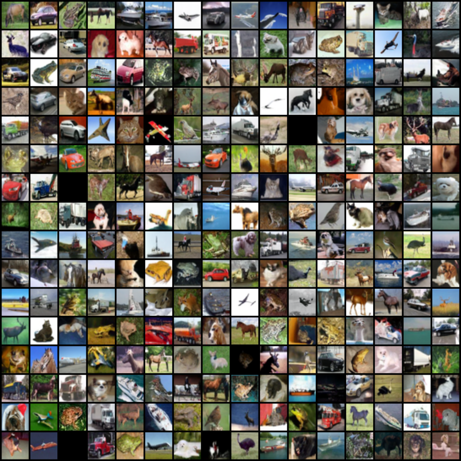
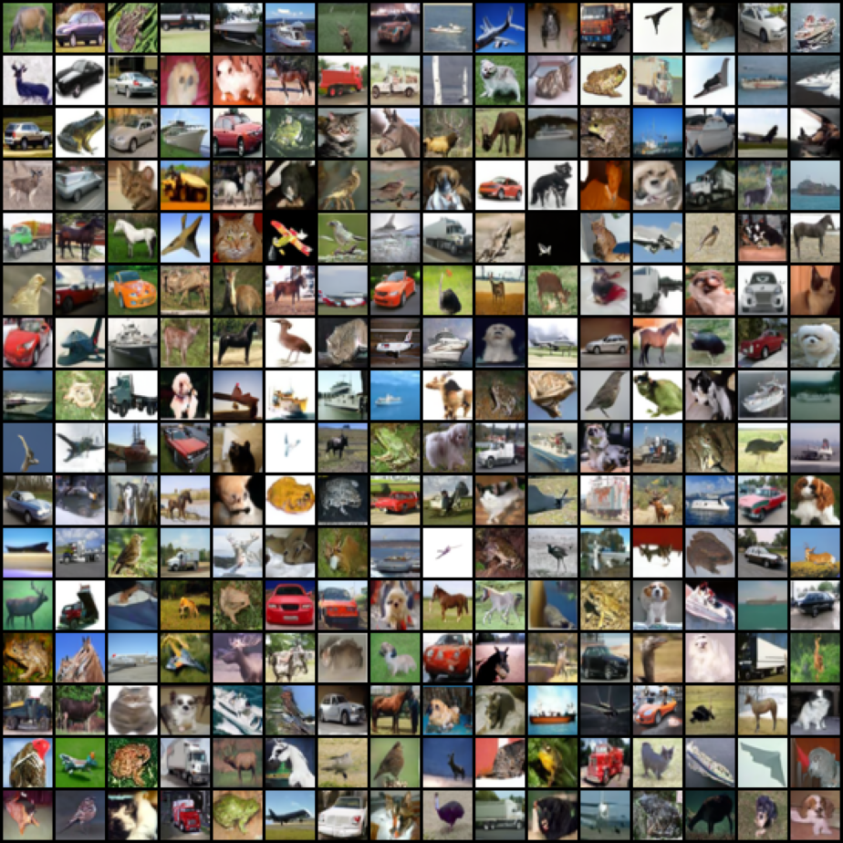

# DDPM and iDDPM

A minimal (and feature complete) implementation of the CIFAR10 models, heavily based off of [DDPM](https://arxiv.org/abs/2006.11239) and [iDDPM](https://arxiv.org/abs/2102.09672).

Includes:
- Training with `L_simple` and `L_hybrid` losses
- VLB (NLL) computations
- Strided generation and NLL computations
- Cosine and Linear schedules


## Installation

```bash
git clone *repo-url*
cd basic-diffusion
pip install -r requirements.txt
```

## Use
```bash
python3 train.py
```

## Models

Two 33M parameter models were trained on CIFAR10 for 500K steps, one with `L_simple` and one with `L_hybrid`:

| Model Config               | Val NLL (BPD) | Wandb link                                                                       |
|----------------------------|---------------|----------------------------------------------------------------------------------|
| Cosine Schedule / L_simple / 1000 steps | 3.54          | [link](https://wandb.ai/bfattori/diffusion-exps/runs/v4534vbi?nw=nwuserbfattori) |
| Cosine Schedule / L_hybrid / 1000 steps | 3.46          | [link](https://wandb.ai/bfattori/diffusion-exps/runs/0qx180hx?nw=nwuserbfattori) |

### Generations

Both generations use the same random seed.


`L_simple`:


`L_hybrid`:


## References

These implementations were used as references: 
- [`openai/improved-diffusion`](https://github.com/openai/improved-diffusion)
- [`hojonathanho/diffusion`](https://github.com/hojonathanho/diffusion)
- [`cfoster0/simple-diffusion-model`](https://github.com/cfoster0/simple-diffusion-model)


```
@misc{ho2020denoisingdiffusionprobabilisticmodels,
      title={Denoising Diffusion Probabilistic Models}, 
      author={Jonathan Ho and Ajay Jain and Pieter Abbeel},
      year={2020},
      eprint={2006.11239},
      archivePrefix={arXiv},
      primaryClass={cs.LG},
      url={https://arxiv.org/abs/2006.11239}, 
}
```

```
@misc{nichol2021improveddenoisingdiffusionprobabilistic,
      title={Improved Denoising Diffusion Probabilistic Models}, 
      author={Alex Nichol and Prafulla Dhariwal},
      year={2021},
      eprint={2102.09672},
      archivePrefix={arXiv},
      primaryClass={cs.LG},
      url={https://arxiv.org/abs/2102.09672}, 
}
```